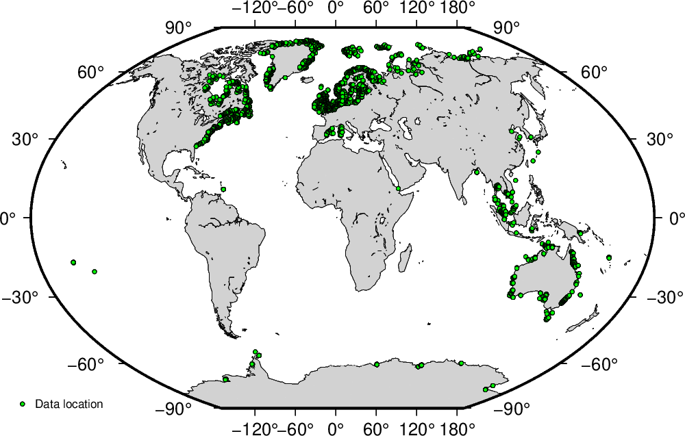

Global Archive of Paleo Sea Level Indicators and Proxies (GAPSLIP)
=============

by:  
Evan James Gowan  
<evangowan@gmail.com>

*Current version: 2.0*

Introduction
-------------

My research since around 2010 has focused on reconstructing ice sheets using glacial isostatic adjustment (GIA) methods. One of the primary observations of GIA is changes in sea level. During a glaciation, sea level in some areas can drop as low as -130 m below present sea level! Due to factors such as the deformation of the Earth due to shifting water/ice loads, gravitational field changes due to the redistribution of mass, and changes to the Earth's rotation, the magnitude of sea level change is spatially variable. Using this information, it is possible to infer the size of the ice sheets.

When I started doing GIA modelling, there was no publicly available repository of sea level data that could be easily used for analysis. As a result, it was necessary to create something. During my PHD in 2013/2014, I created a bunch of scripts to compare sea level data from western Canada with an ice sheet reconstruction I made. This was done in a very chaotic and disorganized way, which was fine for when I was looking at a small area. In 2018-2020, I started working on a global reconstruction, and the demands for me to "show my work" in a model-data comparison forced me to create a more organized structure. This led me to create scripts to create reports that contain these plots.

This was still done in a very tedious way. In 2022, I decided to rewrite the plotting scripts. This allowed me to move away from the clumsy Fortran files I created in my PHD. The updates significantly reduce the time it takes to add data, as I no longer had to manually set up the plot map, nor do I have to create separate folders for different time periods. From version 2.0, released in May 2023, I decided to call this repository the Global Archive of Paleo Sea Level Indicators and Proxies (GAPSLIP).

As of version 2.0, the archive contains data for the last 15,000 years for eastern North America, Greenland, the Baltic and North Seas in Europe, northern Russia, southeastern Asia, Australia and Antarctica. I have also included data in select locations outside of these areas that provide sea level proxies for Marine Isotope Stage 4 and 3 and the Last Glacial Maximum (i.e. 80,000-15,000 years ago).

Acknowledgments
-------------

This project was made possible through the wide efforts of the paleo sea level community, through the PALSEA group. Much of the data here was compiled by the HOLSEA project. Please see the following websites for details.

[PALSEA Website](https://palseagroup.weebly.com/ "PALSEA")

[HOLSEA website](https://www.holsea.org/ "HOLSEA")

E.J.G acknowledges the following funding sources that made all this possible:

- Japan Society for the Promotion of Science International Postdoctoral Fellowship (2021-2023)
- Helmholtz Exzellenznetzwerks "The Polar System and its Effects on the Ocean Floor (POSY)" (2018-2020)
- Helmholtz Climate Initiative REKLIM (Regional Climate Change), a joint research project at the Helmholtz Association of German research centres (HGF) (2016-2018)
- the PACES-II program at the Alfred Wegener Institute (2016-2021)
- Bundesministerium für Bildung und Forschung funded project, PalMod (2016-2021)
- Swedish Research Council FORMAS grant (grant 2013-1600) (2014-2015)
- Australian National University Postgraduate Research Scholarship. (2010-2014)

If you use the GAPSLIP archive, please acknowledge using the following references.

Gowan, E.J., in preparation. An assessment of the PaleoMIST 1.0 ice sheet reconstruction in Greenland using paleo sea level indicators and proxies.

Gowan, E.J., Zhang, X., Khosravi, S., Rovere, A., Stocchi, P., Hughes, A.L., Gyllencreutz, R., Mangerud, J., Svendsen, J.I. and Lohmann, G., 2022. Reply to: Towards solving the missing ice problem and the importance of rigorous model data comparisons. Nature communications, 13(1), pp.1-5. https://doi.org/10.1038/s41467-022-33954-x

Gowan, E.J., Zhang, X., Khosravi, S., Rovere, A., Stocchi, P., Hughes, A.L.C., Gyllencreutz, R., Mangerud, J., Svendsen, J.-I., and Lohmann, G., 2021. A new global ice sheet reconstruction for the past 80000 years. Nature Communications, 12, 1199. https://doi.org/10.1038/s41467-021-21469-w

Special thanks:

- Stephen Lewis for sending me the spreadsheets with the Australia sea level data.
- Alisa V. Baranskaya for sending me the complete references for the Russian sea level database, including translations.
- Simon Engelhart for sending me the reservoir corrections for the eastern United States database.
- Annemiek Vink and Juliane Scheder for sending me the spreadsheets with North Sea data.
- The authors of Generic Mapping Tools, who fixed a couple of issues that were causing problems with plotting the data.

Version history
-------------
- **Version 2.0**: The entire code base for the archive has been rewritten, and now uses a lot of Python instead of the old Fortran programs. The scripts I wrote substantially streamlines the database management. All of the data have been recalibrated using new reservoir corrections and the 2020 updates of the calibration curves. New datasets have been added for Greenland and Australia. (May 11, 2023)
- **Version 1.3**: Added Antarctica data for the Holocene and MIS 3, improved the presentation of index points on the plots, added the ability to calibrate mixed dates and terrestrial reservoir corrections, and improved documentation. (July 4, 2022)
- **Version 1.2**: Updated the database with an update of the Baltic Sea dataset, and added sites from the North Sea. (March 15, 2022)
- **Version 1.1**: Added some new LGM sites (including alternate Bonaparte Gulf interpretations), and modified some of the LGM and MIS 3 sites that I original set to have marine limiting points (due to large uncertainties) to have the originally interpreted sea level index ranges. (November 5, 2021)
- **Version 1.0**: initial release (February 23, 2021)

Usage (folder: latex)
-------------

In this project, there are a series of scripts and programs to plot published paleo-sea level data and calculated sea level, and create a report that shows the results. The scripts require the following:

- bash shell
- latex (specifically Xelatex, so non-Latin text can be implemented easier)
- Python 3, with pandas, numpy, pandas\_ods\_reader and odfpy packages installed
- [Generic Mapping Tools](https://www.generic-mapping-tools.org/ "GMT"), version 6.4 or later.
- Perl (used to parse the radiocarbon calibration javascript file from Oxcal)

I made these scripts in Ubuntu, and I do not guarantee it will work in other operating systems.

The bibtex database is maintained using JabRef.

An example of the workflow in the latex folder to create the report:

- place the calculated sea level in the "calculated\_sea\_level" folder (see instructions on the format in the readme file)
- edit the "create\_plots.sh" file with the ice sheet/earth model combinations that you want to plot (six models can be plotted)
- run create\_plots.sh
- run create\_report.sh

Scratch datasets
------------------

This folder contains the rough spreadsheets where I gather the information I need to add the sea level proxies to the main database. Because of major changes to the marine reservoir corrections with Marine20, it was necessary to change the reservoir correction for all of the datasets. I made scripts to do that, as well as to automatically assigning the region to all the datasets.

In order to determine the region and reservoir correction, I make use of a QGIS tool *qgis\_process*. As such, you need to have QGIS installed to use this. Extracting some of the information also requires the *geopandas* python package.

However, for most end users this step is unnecessary since I include the final database to use with the latex scripts.

Sea Level Data
---------------

The main database is located in the *sea\_level\_data* directory. All of the files are generated automatically using the scripts in the scratch datasets folder and the calibration folder, with the exception of *region_list.txt*, which gives the order which the the sea level sectors are ordered in the documents.

GIS
------------------

This folder contains two shapefiles, one with the regions I use to group the paleo sea level proxies (*region\_bounds.shp*) and one with the reservoir corrections (*delta\_r.shp*). There are also scripts to gather the location of all the data points in the database. 

The reservoir age data are derived from the [Calib archive](http://calib.org/marine/ "Calib archive"). The reference numbers in the shapefile refer to the data points in this database.

Radiocarbon calibration (folder: calibrate)
------------------

To do radiocarbon calibration, I use Oxcal. Put the unzip file of the Oxcal distribution in the "calibrate/" folder (it should create an Oxcal directory). The scripts will know to look there. Although I have included the files with calibrated data, new versions of the calibration curves, and new reservoir ages will require that the radiocarbon dates be re-calibrated.

[Oxcal website](https://c14.arch.ox.ac.uk/oxcal.html "Oxcal")

If you want to recalibrate everything, it should be as simple as running the "run\_all.sh" script. It will go through all the locations in the *sea\_level\_data* directory. If you want to calibrate a single location, you can use the "run\_one.sh" script. You can also just use the "calibrate.sh" script with the region and location as command line options.

The calibrated radiocarbon dates are recorded with 2-sigma uncertainties. In order to make the comparisons the same, the calibration script also takes other dates (which are recorded with 1-sigma uncertainties in the database) and converts them to use 2-sigma limits. All of the "calibrated.txt" dates have 2-sigma uncertainty ranges.

In version 2.0, the data have been calibrated with OxCal version 4.4.4, using IntCal20 for Northern Hemisphere terrestrial material, SHCal20 for Southern Hemisphere terrestrial material, and Marine20 for marine material.

IMCalc
------------------

In some cases, I have used the program IMCalc, originally written by Thomas Lorscheid and Alessio Rovere, to calculate the indicative meaning of sea level indicators. The program was originally written in Java, and I found it difficult to get it to run. Thomas and Alessio sent me the original source code, which I converted into a python script. At the moment, it is set up to only run from the command line. I wrote the main part as a class, so it should be easy to create other implementations. The Coastal Points Database (CPD.cpd), which is needed to run the program, needs to be downloaded from the IMCalc [Sourceforge page](https://sourceforge.net/projects/imcalc/files/ "Sourceforge"). Thanks to Thomas and Alessio for their assistance. Note that in the absence of an input vertical uncertainty, my script will set the uncertainty to 20% of the measurement elevation, to a maximum of 10 m.

Lorscheid, T. and Rovere, A., 2019. The indicative meaning calculator–quantification of paleo sea-level relationships by using global wave and tide datasets. Open Geospatial Data, Software and Standards, 4, pp.1-8. https://doi.org/10.1186/s40965-019-0069-8

Coastlines and borders
------------------

The GIS folder contains global coastlines and borders from GSHHG, which is licensed under GNU Lesser General Public License version 3.

Wessel, P. and Smith, W.H., 1996. A global, self‐consistent, hierarchical, high‐resolution shoreline database. Journal of Geophysical Research: Solid Earth, 101(B4), pp.8741-8743. https://doi.org/10.1029/96JB00104

The coastlines in GSHHG are inaccurate in Greenland, especially for the northern parts of the island. To mitigate this problem, I instead plot the coastline generated from the BedMachine Greenland version 5 topography dataset (i.e. I extracted the 0 m contour). The script to do this is in the folder GIS/Greenland\_Coastline. Bedmachine Greenland can be downloaded below:

Morlighem, M., Williams, C., Rignot, E., An, L., Arndt, J. E., Bamber, J., Catania, G., Chauché, N.,
Dowdeswell, J. A., Dorschel, B., Fenty, I., Hogan, K., Howat, I., Hubbard, A., Jakobsson, M., Jordan, T. M.,
Kjeldsen, K. K., Millan, R., Mayer, L., Mouginot, J., Noël, B., O'Cofaigh, C., Palmer, S. J., Rysgaard, S.,
Seroussi, H., Siegert, M. J., Slabon, P., Straneo, F., van den Broeke, M. R., Weinrebe, W., Wood, M., &
Zinglersen, K. (2022). IceBridge BedMachine Greenland, Version 5. Boulder,
Colorado USA. NASA National Snow and Ice Data Center Distributed Active Archive Center.
https://doi.org/10.5067/GMEVBWFLWA7X

Morlighem, M., Williams, C., Rignot, E., An, L., Arndt, J. E., Bamber, J., Catania, G., Chauché, N.,
Dowdeswell, J. A., Dorschel, B., Fenty, I., Hogan, K., Howat, I., Hubbard, A., Jakobsson, M., Jordan, T. M.,
Kjeldsen, K. K., Millan, R., Mayer, L., Mouginot, J., Noël, B., O'Cofaigh, C., Palmer, S. J., Rysgaard, S.,
Seroussi, H., Siegert, M. J., Slabon, P., Straneo, F., van den Broeke, M. R., Weinrebe, W., Wood, M., &
Zinglersen, K. (2017). BedMachine v3: Complete bed topography and ocean bathymetry mapping of
Greenland from multi-beam echo sounding combined with mass conservation. Geophysical Research
Letters, 44. https://doi.org/10.1002/2017GL074954

